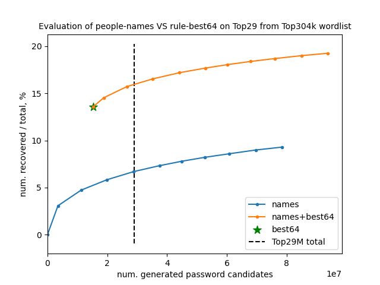

# People names as passwords

Parse popular wordlists to create masks of how people names are used as passwords. These masks can be directly fed into [hashcat](https://github.com/hashcat/hashcat).

The outcome of this research project will be eventually utilized in [hashcat-wpa-server](https://github.com/dizcza/hashcat-wpa-server) as an additional attack vector.

## Quick run

### Create masks

```
$ sudo apt install konwert
$ ./run.sh
$ head -n10 masks/masks.count
   4629 ||||||||
   2005 |||||||1
   1878 |||||123
   1804 |||||||||
   1103 ||||||123
   1068 |||||||s
    963 ||||||12
    795 ||||||||1
    749 ||||||01
    716 ||||1234
```

(You will see different output, depending on the choice of a wordlist to scan for names.)

Here is how you read the output:
* plain names of exactly 8 characters appeared 4629 times;
* names of length 7 with suffix `1` appeared 2005 times ...

The `run.sh` script needs to be run only once.

### Hashcat masks

To convert top 100 'masks' into hashcat lowercase masks, run

```
$ awk 'FNR<=100 { gsub("\\|", "l?"); print $2 }' masks/masks.count > masks/masks.hashcat
```


### Generate probable passwords

To avoid brute forcing with hashcat masks, a better idea is to generate new _probable_ passwords:

```
$ gcc -O1 -o generate src/generate.c
$ ./generate -n 1000 names/names.count masks/masks.count
```

The script above prints top `1000` password candidates to the standard output. The output can be piped in `hashcat --stdin`. Password generation is fast - approximately 14M candidates per second.


## Evaluation

Below is the evaluation of the proposed password candidates generation, compared to hashcat [best64 rule](https://github.com/hashcat/hashcat/blob/master/rules/best64.rule). The task is to reconstruct the passwords from Top29M as much as possible, using Top304k wordlist (refer [here](https://github.com/berzerk0/Probable-Wordlists/tree/master/Real-Passwords) for wordlists information).

To recreate the plot, run

```
$ ./evaluation/evaluate.sh
$ pip install matplotlib numpy
$ python evaluation/plot_evaluation.py
```

Beware: it will take about 1 hour to run the script.



It's clearly seen that people-names-as-passwords generator should be used only after hashcat best64 rule has been run.

## In Depth

* [create masks from names explained](doc/create_masks.md)
* [generate new passwords explained](doc/generate.md)
